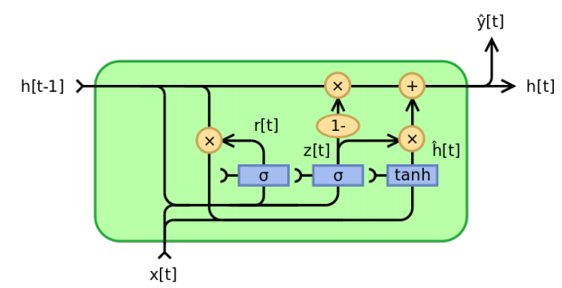

# RNN and LSTM

Intro to Deep Learning assignment:

## RNNs and GRUs and CTCs

> [mytorch](mytorch) is my custom deep learning library, built entirely in NumPy, that functions similarly to established DL lebraries like PyTorch or TensorFlow, for the three following assignments

### 1. Recurrent neural network

The first part of this assignment is to implement from scratch a **multi-layer Elman Recurrent Neural Network** module with the ability to handle variable length inputs in the same batch **using NumPy only**

* For this, I implemented the forward and backward pass of an RNN cell in [mytorch/rnn_cell.py](mytorch/rnn_cell.py) which is later used in [hw3/rnn_classifier.py](hw3/rnn_classifier.py) to build an **RNN classifier**

### 2. Gated Recurrent Unit

The second part is to implement from scratch a portion of the [torch.nn.GRUCell](https://pytorch.org/docs/stable/generated/torch.nn.GRUCell.html) **using NumPy only** and combine it with a linear layer to compose a neural net, namely `CharacterPredictor`, in [hw3/gru_classifier.py](hw3/gru_classifier.py)

The computation flow for GRU

* For this, I implemented the forward and backward pass for a **GRUCell** in [mytorch/gru_cell.py](mytorch/gru_cell.py)

* Since there are **fourteen** gradients that need to be computed, the backward method of the GRUCell is one of the most time-consuming tasks here; To simplify the computation, I rewrote the computation for the forward past in terms of unary and binary operations following the same order.

* Given a sequence of inputs, [hw3/gru_classifier.py](hw3/gru_classifier.py) implements the `CharacterPredictor` neural network and `inference` function to output logits for all the timesteps 

### 3. Connectionist Temporal Classification Loss

In the third part, the goal is to implement from scratch the [CTC Loss](https://www.cs.toronto.edu/~graves/icml_2006.pdf) in [mytorch/ctc_loss.py](mytorch/ctc_loss.py) **using NumPy only**

* Given the output sequence from an RNN/GRU, [mytorch/ctc.py](mytorch/ctc.py) implements the `CTC` class for the computation of the forward, backward, and post probabilities that are later used to derive the CTC Loss

* For this, I implemented the forward and backward pass of the CTC Loss in [mytorch/ctc_loss.py](mytorch/ctc_loss.py)

## Stacked LSTM with a CTC beam search decoder 
For this part, the goal is to **predict the phonemes contained in utterances** in the test set without given aligned phoneme labels in the training data, which means the correlation between the features and labels in the train set is not given explicitly, so the model has to figure this out by itself.

* **Training features**: Mel-spectrograms that have 13 band frequencies for each time step of the speech data
* **Training labels**: A list of phonemes contained in utterance. There are 41 phoneme labels, and the phoneme array will be as long as however many phonemes are in the utterance.

**NOTE**: The training labels will not have a direct mapping to each time step of the training features

* It is also a Kaggle competition, and all the details can be found [here](https://www.kaggle.com/competitions/11785-homework-3-part-2-slack-seq-to-seq)
* My model achieves an **8.56107** score on phoneme state labels in the `test` set
* It's ranked **14th** among 300+ students in the class
* All the work for this part can be found in [lstm_and_ctc.ipynb](lstm_and_ctc.ipynb)
* The model is composed of 2 convolution  layers, followed by one **bi-directional lstm** with 5 hidden layers and then two fully connected layers.
* I trained my model using [nn.CTCLoss](https://pytorch.org/docs/stable/generated/torch.nn.CTCLoss.html) and decoded the output of your model using beam search from [ctcdecode](https://github.com/parlance/ctcdecode)
* Submitted models are evaluated using Kaggle’s character-level string edit distance. Each phoneme is mapped to a single character, so models are evaluated on **phoneme edit-distance**. Levenshtein distance was used for this purpose.

